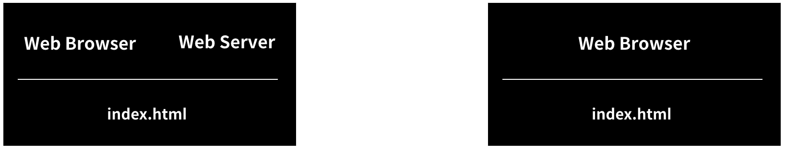

## 2021.09.22(WED) 생활코딩 WEB1-HTML 강의

## WEB1 - 18 : 웹호스팅(github pages)
- 직접 제작해본 웹페이지 : https://jarvis-geun.github.io/WEB1-HTML/
### Reference
> https://opentutorials.org/course/3084/18891

<br>

## WEB1 - 19 : 웹서버 운영하기
- Apache(아파치) 설치하기 : 단 한번도 1등의 자리를 내준 적이 없는 웹 서버 소프트웨어

### Reference
> https://opentutorials.org/course/3084/18892

<br>

## WEB1 - 19.1.1 : 웹 서버 운영(윈도우)
- bitnami wamp stack 설치
- 설치 후, bitnami WAMP stack Manager Tool 실행
- Go to application을 실행하면 웹사이트로 이동한다.
- Manage Servers에서 Apache Web Server의 작동을 제어할 수 있다(Start / Stop 버튼 사용).

### Reference
> https://opentutorials.org/course/3084/18893

<br>

## WEB1 - 19.1.2 : 웹서버와 http

> http://127.0.0.1/index.html

- 127.0.0.1 : Internet Protocol Address(IP 주소)<br>
  웹브라우저가 설치되어 있는 각자의 컴퓨터의 웹서버를 지칭

> C:\Bitnami\wampstack-7.4.23-0\apache2\htdocs

- 위의 주소에 있는 로컬 파일이 곧 웹서버에 저장되어 있는 html 파일이다. 따라서 위의 주소에 있는 모든 파일을 제거한 후, 만들고자 하는 html 파일을 덮어씌워주면 된다.
- index.html, 1.html, 2.html, 3.html, img-html.jpg 파일을 덮어씌웠다.

### http를 통해 실행 vs 로컬 파일을 직접 실행
```
http://127.0.0.1/index.html
```

```
file:///C:/Bitnami/wampstack-7.4.23-0/apache2/htdocs/index.html
```
<br>

**위의 두 예시의 차이점은 무엇일까?**

1. http : Hyper Text Transfer Protocol<br>
   Hyper Text : 웹페이지<br>
   Transfer : 전송하다<br>
   Protocol : 규약, 약속<br>

   => 웹페이지를 웹브라우저와 웹서버가 주고받기 위한 약속

2. 로컬 파일<br>
   말 그대로 로컬 컴퓨터에 있는 파일을 실행한 것으로, 같은 컴퓨터에서 실행할 경우 http와 큰 차이가 없는 것처럼 보인다. 하지만 여러 대의 컴퓨터를 대상으로 위의 두 예시를 비교해보면 차이가 나는 것을 알 수 있다. 로컬 파일은 그 파일이 있는 컴퓨터에서만 실행이 되지만, http의 경우 주소만 입력해주면 웹브라우저가 웹서버에 연결해서 파일을 실행해준다.

아래의 이미지를 보면 더 이해가 쉬울 것이다. 왼쪽이 http를 통해 접속할 때, 오른쪽이 로컬 파일을 실행할 때를 표현한 것이다.



### Reference
> https://opentutorials.org/course/3084/18893

<br>

## WEB1 - 19.1.3 : 웹서버와 웹브라우저의 통신(윈도우)

IPv4 주소 찾는 방법
1. 제어판 실행
2. 네트워크 및 인터넷 클릭
3. 네트워크 상태 및 작업 보기 클릭
4. 연결 : Wi-fi(또는 이더넷) 클릭
5. 자세히 클릭
6. IPv4 주소 확인

```
127.0.0.1 : 모든 컴퓨터가 자기 자신을 127.0.0.1로 지정하기로 전세계적으로 약속함
```

1. 두 대의 컴퓨터(혹은 한 대의 스마트폰과 한 대의 컴퓨터)를 동일한 네트워크에 연결한다.
2. 스마트폰의 웹브라우저로 IPv4 주소에 연결하면 웹서버에서 만들어놓은 웹페이지가 열리는 것을 확인할 수 있다.

### Reference
> https://opentutorials.org/course/3084/18893

<br>

## WEB1 - 20 : 수업을 마치며 1/3
### Reference
> https://opentutorials.org/course/3084/18896

<br>

## WEB1 - 20 : 수업을 마치며 2/3
### Reference
> https://opentutorials.org/course/3084/18896

<br>

## WEB1 - 20 : 수업을 마치며 3/3
### Reference
> https://opentutorials.org/course/3084/18896